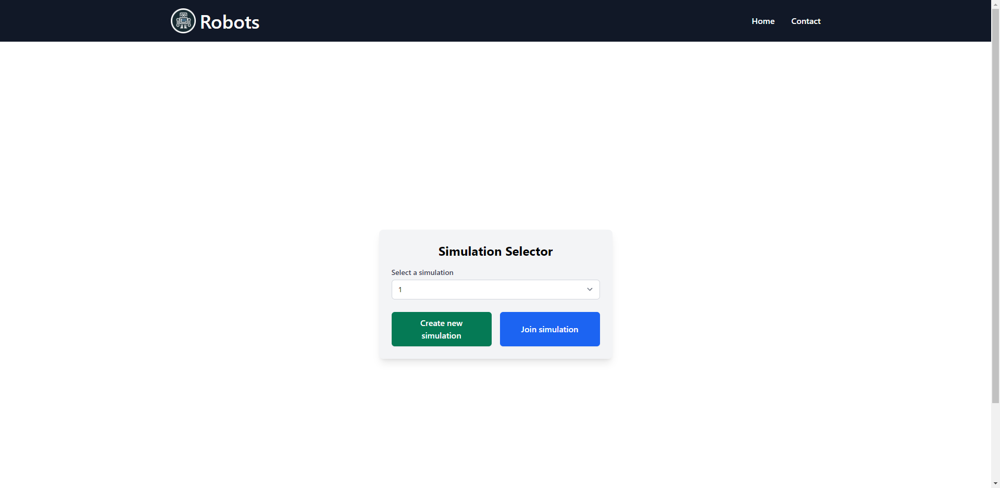
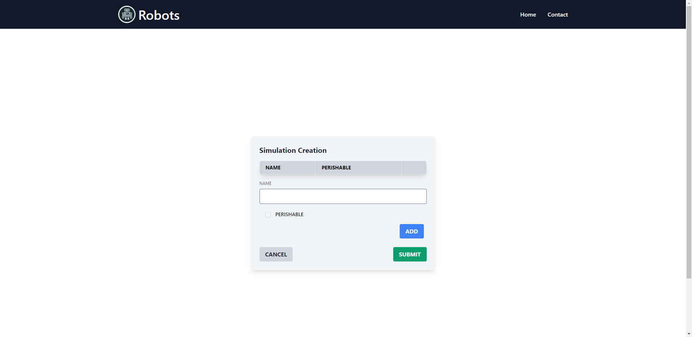
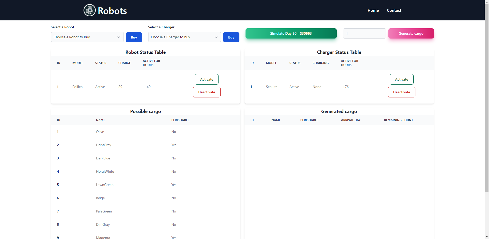
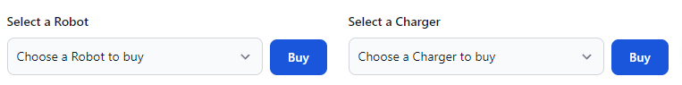
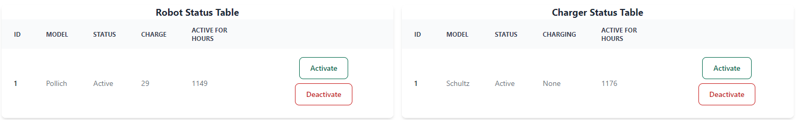
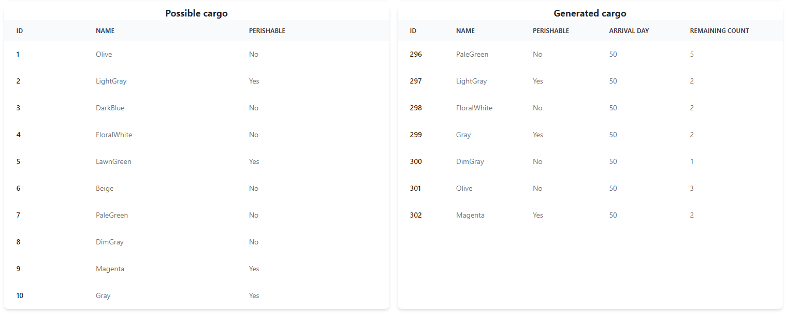
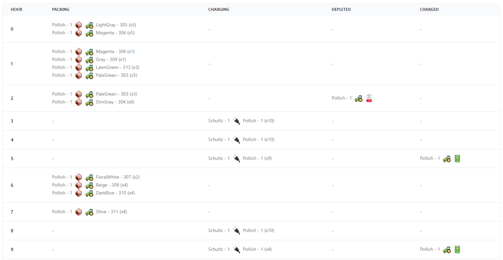

# Robot

This Laravel project simulates robots and chargers in a warehouse environment. The robots are responsible for moving cargo, while the chargers are responsible for charging the robots.

This project is built on top of the  framework.

## Table of Contents
- [Installation](#installation)
- [Usage](#usage)
  - [Starting the Application](#starting-the-application)
  - [Creating and Joining Simulations](#creating-and-joining-simulations)
  - [Dashboard Screen Robot and Charger Purchase](#dashboard-screen-robot-and-charger-purchase)
  - [Robot and Charger Management](#robot-and-charger-management)
  - [Simulating and Generating Cargo](#simulating-and-generating-cargo)
- [Screenshots](#screenshots)
- [License](#license)

## Installation

1. Clone the repository: `git clone https://github.com/EVP-11-csapat/robotok.git`
2. Navigate to the project directory: `cd robotok`
3. Install the dependencies: `composer install | npm install`
4. Create a copy of the .env file: `cp .env.example .env`
5. Generate an application key: `php artisan key:generate`
6. Configure the database settings in the .env file
7. Run the database migrations: `php artisan migrate`
8. Seed the database: `php artisan db:seed`

## Usage

### Starting the Application
1. To start the application, run the following commands: `npm run dev` `php artisan serve`
2. Open the website in your browser: `localhost:8000`

### Creating and Joining Simulations
1. Upon visiting the Robots site, you will be presented with a dropdown selector to choose a simulation. [*](#main-screen)
2. At the bottom of the dropdown, you will find a "Create new Simulation" button and a "Join Simulation" button.
3. Clicking the "Create Simulation" button will take you to the Create screen. [*](#create-simulation-screen)
4. On the Create screen, you can add a product to the template products:
   - Enter the name of the product in the `NAME` field.
   - Check the `PERISHABLE` checkbox if the product is perishable.
   - Click the `ADD` button to add the product to the template table.
   - An associated `DELETE` button will be added for each product.
5. If you **don't** enter any products, the system will automatically generate 10 template products.
6. Press the `SUBMIT` button to enter the dashboard screen [*](#dashboard-screen).
7. Clicking the `Join Simulation` button on the dashboard screen will also take you to the dashboard screen.

### Dashboard Screen Robot and Charger Purchase [*](#buy-section)
1. On the dashboard screen, there is a dropdown menu to select a robot from a generated list.
2. Next to the robot dropdown, you will find a `Buy` button.
3. A similar dropdown and button combination is available for selecting and purchasing chargers.
4. Next to the chargers dropdown, you will find a "Buy Charger" button.
5. Initially, purchased robots and chargers are inactive.
6. To activate a robot or a charger, click the `Activate` button next to them.

### Robot and Charger Management [*](#robot-and-charger-management-tables)
1. On the dashboard screen, you will find two tables for robot and charger management.
2. The robot management table displays the details of purchased robots, including their names, activation status, current charge and active hours.
3. The charger management table displays the details of purchased chargers, including their names, activation status, if they are currently charging a robot and active hours.

### Simulating and Generating Cargo
1. On the dashboard screen, you will see a `Simulate` button, which also displays the **current day** and the **cumulative balance** of the current simulation.
2. Next to the "Simulate" button, there is a field where you can enter the desired number of cargos for the day.
3. Press the `Generate Cargo` button to generate the specified number of cargos.
4. Below this section, there are five tables:
   - Two tables for robot and charger management, as mentioned above. [*](#robot-and-charger-management-tables)
   - Two tables for template and generated cargo, displaying product details. [*](#template-and-generated-cargo-tables)
   - One table for the log of previous days. [*](#previous-days-log)

## Screenshots

Here are some screenshots of the Robots application for reference:

1. ### Main Screen:
   

2. ### Create Simulation Screen:
   

3. ### Dashboard Screen:
   

4. ### Buy Section:
    

5. ### Robot and Charger Management Tables:
   

6. ### Simulate and Generate Cargo:
   

7. ### Template and Generated Cargo Tables:
   

8. ### Previous Days' Log:
   
   
## Documentation

## License

This project is licensed under the MIT License. See the [LICENSE](LICENSE) file for details.
